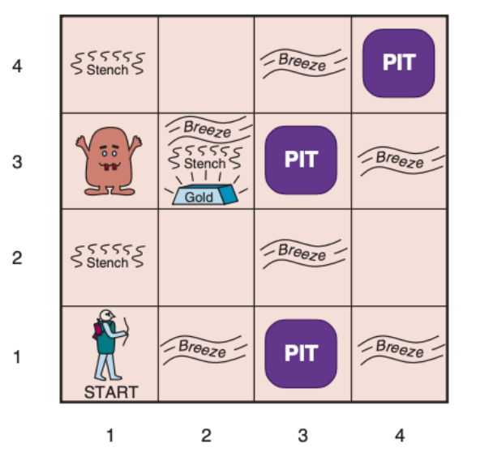

# Wumpus World game to learn Propositional logic and Predicate logic

## - install prolog
[https://www.swi-prolog.org/download/stable](https://www.swi-prolog.org/download/stable)
## - Clone
git clone https://github.com/nvdieu/wumpus-prolog.git
## - wumpus game play
cd wumpus-prolog

swipl

-? consult('wumpus.qlf').

-? start.

## - using help command in game to describe the commands of game
## - Wumpus example in AIMA book (Stuart J. Russell and Peter Norvig)

## - Rule:
1 wumpus, 1 gold, 1 or more pit.

Start position at (0,0).

Use climbdown to (1,1) position.

Go around to find and grab gold.

Turn back to (1,1) position.

Use climbup to (0,0) position and finish: Win
